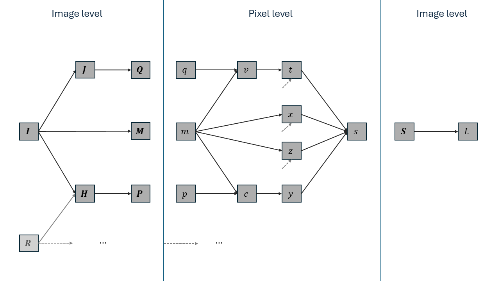

# Mathematics

The following equations and notation can help in understanding the code, especially for the backward pass.

## Forward
Let $\matr{K} \in \mathbb{R}^{(2r + 1) \times (2r + 1)}$ be the Gaussian SSIM kernel with radius $r \in \mathbb{N}$ (normally $r = 5$): 

$$K_{ji} \propto \exp \left(-\frac{i^2 + j^2}{2\sigma^2} \right),$$

where $\sigma = 1.5$, we indexed $\matr{K}$ via $-r \leq i, j \leq r$, and the proportionality constant is such that $\sum_{ji} K_{ji} = 1$. For any grayscale image $\matr{I} \in \mathbb{R}^{h \times w}$, the convolution $\matr{M} \coloneqq \matr{M}_{\matr{I}} \coloneqq \matr{I} * \matr{K} \in \mathbb{R}^{h \times w}$ contains local means (locally averaged intensities) from $\matr{I}$, i.e. local first moments. Note that we will use zero-padding to make $\matr{M}$ the same size as $\matr{I}$. Similarly, $\matr{Q} = \matr{I}^2 * \matr{K}$ (where the square is elementwise) contains local second (quadratic) moments. Local variances can then be computed as $\matr{V} = \matr{Q} - \matr{M}^2$, cf. $\Var[X] = \E[X^2] - \E[X]^2$ for a random variable $X$. If we have a second (reference) image $\matr{R} \in \mathbb{R}^{h \times w}$ and $\matr{P} = (\matr{I} \odot \matr{R}) * \matr{K}$ with $\odot$ denoting the Hadamard (i.e. componentwise) product, then $\matr{C} = \matr{P} - \matr{M}_{\matr{I}} \odot \matr{M}_{\matr{R}}$ contains local covariances between the images, cf. $\Cov[X, Y] = \E[XY] - \E[X]\E[Y]$.

The SSIM map $\matr{S}(\matr{I}, \matr{R}) \in \mathbb{R}^{h \times w}$ between our images is now defined as

$$\matr{S}(\matr{I}, \matr{R}) = \frac{(2 \matr{M}_{\matr{I}} \odot \matr{M}_{\matr{R}} + \alpha)(2\matr{C} + \beta)}{(\matr{M}_{\matr{I}}^2 + \matr{M}_{\matr{R}}^2 + \alpha)(\matr{V}_{\matr{I}} + \matr{V}_{\matr{R}} + \beta)}.$$

Here all operations are elementwise, and $\alpha$ and $\beta$ are two small constants to avoid numerical instability by division by (near) zero. If the intensities are normalised to lie in $[0, 1]$, we will use $\alpha = 0.01^2$ and $\beta = 0.03^2$, following standard practices. The actual SSIM is then simply the mean of the SSIM map. If our images have multiple color channels, we take the average of the per-channel SSIM values.

### In the code
We always work with batches of images with one or more color channels. Because the batch axis is the last one, the separate images are contiguous in memory, so we can simply loop over them. Therefore, we will only consider a single image pair from now on. The channel axis is the first one, so we cannot do the same for the color channels. Instead we will always process all channels of a pixel at the same time. Because the operations are the same for each channel and we simply average in the end, we will again only consider grayscale images.

We will exploit that the kernel $\matr{K}$ is separable, so that we can replace a 2D convolution with $\matr{K}$ by two 1D convolutions, one horizontal and one vertical. This (single) 1D kernel $\vect{k} \in \mathbb{R}^{2r + 1}$ satisfies

$$k_i \propto \exp \left(-\frac{i^2}{2\sigma^2} \right)$$

for $-r \leq i \leq r$. Also note that all kernels are symmetric, so that there is no difference between convolution and cross-correlation:

$$(\matr{I} * \matr{K})_{ji} = \sum_{q, p} I_{j-q, i-p} K_{q, p} = \sum_{q, p} I_{j+q, i+p} K_{-q, -p} = \sum_{q, p} I_{j+q, i+p} K_{q, p} = (\matr{I} \star \matr{K})_{ji}.$$

We want to avoid materialising the matrices we mentioned above (e.g. $\matr{M}_{\matr{I}}$) as much as possible. Therefore, we only implicitly store them, in shared memory. We divide the SSIM map to compute (as well as the input images) into non-overlapping tiles. Each of these tiles will be handled by a single thread-block, where each pixel in a tile will be computed by one thread in the block. If a thread needs to find the SSIM map at location $(j, i)$, it needs access to the values in the square between $(j - r, i - r)$ and $(j + r, i + r)$. Therefore, each thread-block will load its own pixels from $\matr{I}$ and $\matr{R}$ into shared memory, but with a margin of $r$ pixels to all sides. Consequently we might go out of bounds for $\matr{I}$ and $\matr{R}$, in which case we implicitly pad using zeros. So if our blocks are of size $H \times W$ we need to load an enlarged tile of size $(H + 2r) \times (W + 2r)$. The horizontal convolution then reduces this to $(H + 2r) \times W$ and the vertical convolution to $H \times W$. Note that the different $(H + 2r) \times (W + 2r)$ tiles do overlap, and that for pixels in overlap regions we will compute convolutions multiple times. But this is worth it to avoid having to go to global memory.

At the end we will have obtained the SSIM map in local memory. Since we are only interested in the SSIM map itself, we only need the average. We can then immediately reduce the SSIM map blockwise. Reducing it further to a single value is trickier, as this requires inter-block memory accesses. We found atomic operations to work efficiently in this situation.

## Backward

Writing $L = \SSIM(\matr{I}, \matr{R}) \in \mathbb{R}$, we want to find $\frac{\partial L}{\partial \matr{I}} \in \mathbb{R}^{1 \times (h \times w)}$. 

### Computational graph
Our mathematical computations in the forward pass can be visualized in the following computational graph.

The variables here are
*   $\matr{I} \in \mathbb{R}^{h \times w}$: the (grayscale) input image with respect to which we want to find the gradient  
*   $\matr{R} \in \mathbb{R}^{h \times w}$: the reference image (we consider constant)
*   $\matr{M} \in \mathbb{R}^{h \times w}$: $\matr{M} = \matr{I} * \matr{K}$ the first moments (means)
    *   $\matr{K} \in \mathbb{R}^{(2r + 1) \times (2r + 1)}$ is the Gaussian SSIM kernel of radius $r \in \mathbb{N}$
*   $\matr{J} \in \mathbb{R}^{h \times w}$: $\matr{J} = \matr{I} \odot \matr{I}$, the componentwise square of $\matr{I}$
*   $\matr{Q} \in \mathbb{R}^{h \times w}$: $\matr{Q} = \matr{J} * \matr{K}$: the quadratic moments
*   $\matr{H} \in \mathbb{R}^{h \times w}$: $\matr{H} = \matr{I} \odot \matr{R}$: the Hadamard product of $\matr{I}$ and $\matr{R}$
*   $\matr{P} \in \mathbb{R}^{h \times w}$: $\matr{P} = \matr{H} * \matr{K}$: the averaged product, to be used for the covariance.

After this phase where we have to work across different pixels due to the convolution, all pixels are handled independently, so we just fix one pixel. The value of the matrices (in bold capital letters) at this pixel are written in lower case. E.g. $q$ is one value in the $\matr{Q}$-matrix. The following variables are then
*   $v = q - m^2$: the local variance in image $\matr{I}$ in the neighbourhood centered around our pixel
*   $c = p - m \cdot m_R$: the local covariance between images $\matr{I}$ and $\matr{R}$
    *   $m_R$ is the $\matr{K}$-weighted mean of $\matr{R}$ at our pixel, i.e. an entry in $\matr{M}_{\matr{R}} = \matr{R} * \matr{K}$. Like $\matr{R}$ itself, it is a constant for the purposes of obtaining the gradient with respect to $\matr{I}$.
*   $x = 2 m \cdot m_R + \alpha$: the first numerator factor in the SSIM map formula
    *   $\alpha = 0.01^2$ is the first stabilization constant for the division
*   $y = 2 c + \beta$: the second numerator factor in the SSIM map formula
    *   $\beta = 0.03^2$ is the second stabilization constant
*   $z = m^2 + m_R^2 + \alpha$: the first denominator factor
*   $t = v + v_{\matr{R}} + \beta$: the second denominator factor
    *   with $v_{\matr{R}}$ the $\matr{R}$-equivalent to $\matr{I}$'s $v$
*   $s = \frac{xy}{zt}$: the SSIM map value at our pixel.

Finally, the SSIM $L$ is the average of all the $N$ SSIM map values $s$: $L = \frac{1}{N} \sum_{ji} S_{ji}$.

### Gradients

Most of the gradients are trivial to compute:
*   $\frac{\partial L}{\partial s} = \frac{1}{N}$, where $N$ is the number of pixels in the image.
*   $\frac{\partial L}{\partial x} = \frac{\partial L}{\partial s}\frac{\partial s}{\partial x} = \frac{1}{N} \frac{y}{zt} (=\frac{s}{Nx})$
*   $\frac{\partial L}{\partial y} = \frac{1}{N} \frac{x}{zt} (=\frac{s}{Ny})$
*   $\frac{\partial L}{\partial z} = -\frac{1}{N} \frac{xy}{z^2t} (=-\frac{s}{Nz})$
*   $\frac{\partial L}{\partial t} = -\frac{1}{N} \frac{xy}{zt^2} (=-\frac{s}{Nt})$
*   $\frac{\partial L}{\partial v} = \frac{\partial L}{\partial t} \frac{\partial t}{\partial v} = -\frac{1}{N} \frac{xy}{zt^2} (=-\frac{s}{Nt})$
*   $\frac{\partial L}{\partial c} = \frac{\partial L}{\partial y} \frac{\partial y}{\partial c} = \frac{2}{N} \frac{x}{zt} (=\frac{2s}{Ny})$
*   $\frac{\partial L}{\partial q} = \frac{\partial L}{\partial v} \frac{\partial v}{\partial q} = -\frac{1}{N} \frac{xy}{zt^2} (=-\frac{s}{Nt})$
*   $\frac{\partial L}{\partial p} = \frac{\partial L}{\partial c} \frac{\partial c}{\partial p} = \frac{2}{N} \frac{x}{zt} (=\frac{2s}{Ny})$
*   $\frac{\partial L}{\partial m} = \frac{\partial L}{\partial x} \frac{\partial x}{\partial m} + \frac{\partial L}{\partial z} \frac{\partial z}{\partial m} + \frac{\partial L}{\partial v} \frac{\partial v}{\partial m} + \frac{\partial L}{\partial c} \frac{\partial c}{\partial m} = \frac{1}{N} \frac{y}{zt} \cdot 2m_{\matr{R}} - \frac{1}{N} \frac{xy}{z^2t} \cdot 2m -\frac{1}{N} \frac{xy}{zt^2} \cdot (-2m) + \frac{2}{N} \frac{x}{zt} \cdot (-m_{\matr{R}}) = \frac{2 (y - x)}{Nzt} m_{\matr{R}} + \frac{2xy}{Nzt}\left( \frac{1}{t} - \frac{1}{z} \right) m = \frac{2}{Nzt} \left( (y - x) m_{\matr{R}} + \frac{xy}{zt}( z - t) m \right) = \frac{2}{Nzt} \left( (y - x) m_{\matr{R}} + s( z - t) m \right)$
    *  (Alternatively: $\frac{\partial L}{\partial m} = \frac{2s}{Nx} m_{\matr{R}} - \frac{2s}{Nz} m + \frac{2s}{Nt} m - \frac{2s}{Ny} m_{\matr{R}} = \frac{2s}{N} \left( \left(\frac{1}{x} - \frac{1}{y} \right) m_{\matr{R}} + \left(\frac{1}{t} - \frac{1}{z} \right) m \right)$)

These then form the components of the gradient 'images' $\frac{\partial L}{\partial \matr{Q}}, \frac{\partial L}{\partial \matr{P}}, \frac{\partial L}{\partial \matr{M}} \in \mathbb{R}^{1 \times (h \times w)} \cong \mathbb{R}^{h \times w}$. Now note that for e.g. $\frac{\partial L}{\partial \matr{J}} = \frac{\partial L}{\partial \matr{Q}} \frac{\partial \matr{Q}}{\partial \matr{J}} \in \mathbb{R}^{1 \times (h \times w)}$ we have

$$\left(\frac{\partial L}{\partial \matr{J}}\right)_{1ji} = \sum_{l,k} \left(\frac{\partial L}{\partial \matr{Q}}\right)_{1lk} \left(\frac{\partial \matr{Q}}{\partial \matr{J}}\right)_{lkji} = \sum_{l,k} \frac{\partial L}{\partial Q_{lk}} \frac{\partial Q_{lk}}{\partial J_{ji}}.$$

Recalling that $\matr{Q} = \matr{J} * \matr{K}$, i.e. $Q_{lk} = \sum_{q, p = -r}^r J_{l-q, k-p} K_{qp}$, we see that $\frac{\partial Q_{lk}}{\partial J_{ji}} = K_{l-j,k-i}$ when $-r \leq (q =)\; l - j, (p =)\; k - i \leq r$, and $0$ otherwise. Therefore,

$$\left(\frac{\partial L}{\partial \matr{J}}\right)_{1ji} = \sum_{q,p} \frac{\partial L}{\partial Q_{j+q,i+p}} K_{q,p}.$$

In other words, $\frac{\partial L}{\partial \matr{J}} = \frac{\partial L}{\partial \matr{Q}} \star \matr{K}$. Note that we need to use zero-padding here. For example, the top-left pixel in $\matr{J}$ affects $(r + 1)^2$ entries in $\matr{Q} = \matr{J} * \matr{K}$, namely the in-bounds ones from the surrounding square of side length $2r + 1$. There are no out of bounds contributions, so those entries in $\frac{\partial L}{\partial \matr{Q}}$ need to be considered as $0$.

We can now find the final gradients:
*   $\frac{\partial L}{\partial \matr{J}} = \frac{\partial L}{\partial \matr{Q}} \star \matr{K}$
*   $\left(\frac{\partial L}{\partial \matr{I}}\right)_{\matr{J}} = \frac{\partial L}{\partial \matr{J}} \odot 2 \matr{I}$
    * The subscript $\matr{J}$ indicates that in the computational graph we are only considering the path going through $\matr{J}$.
*   $\frac{\partial L}{\partial \matr{H}} = \frac{\partial L}{\partial \matr{P}} \star \matr{K}$
*   $\left(\frac{\partial L}{\partial \matr{I}}\right)_{\matr{H}} = \frac{\partial L}{\partial \matr{H}} \odot \matr{R}$
*   $\left(\frac{\partial L}{\partial \matr{I}}\right)_{\matr{M}} = \frac{\partial L}{\partial \matr{M}} \star \matr{K}$
*   $\frac{\partial L}{\partial \matr{I}} = \left(\frac{\partial L}{\partial \matr{I}}\right)_{\matr{J}} + \left(\frac{\partial L}{\partial \matr{I}}\right)_{\matr{H}} + \left(\frac{\partial L}{\partial \matr{I}}\right)_{\matr{M}}$.

For color images not much changes as we deal with the channels separately. Instead of fixing a pixel, we fix a pixel component, and $N$ now is the total number of pixel components.

### In the code
In the forward pass we already compute and save $\frac{\partial L}{\partial \matr{Q}}$, $\frac{\partial L}{\partial \matr{M}}$ and $\frac{\partial L}{\partial \matr{P}}$. (Note that if we are only interested in the gradient and not the SSIM value itself, we do not even have to perform the reduction on the implicit local memory SSIM map $\matr{S}$.) The backward pass then only corresponds to computing and combining the cross-correlations of these matrices with $\matr{K}$. We will use separate kernels for the forward and backward pass, and really store $\frac{\partial L}{\partial \matr{M}}$ and friends in global memory. The alternative where we keep everything in shared memory would require working with overlapping tiles of $(H + 4r) \times (W + 4r)$ pixels to eventually produce after two 2D cross-correlations a gradient block of $H \times W$. The amount of redundant computations outweights the benefit of not going to global memory.

### A note on padding
We could have allowed convolutions to decrease the size of the images (valid padding). For example, when $\matr{I} \in \mathbb{R}^{h \times w}$, then $\matr{M} = \matr{I} * \matr{K} \in \mathbb{R}^{(h - 2r) \times (w - 2r)}$. For the SSIM value we then ignore the boundary pixels of $\matr{I}$ and $\matr{R}$. [Python's skimage](https://scikit-image.org/docs/stable/api/skimage.metrics.html#skimage.metrics.structural_similarity) does this for example (though by cropping the full SSIM map in $\mathbb{R}^{h \times w}$), and so does and [SSIMLoss.jl](https://github.com/nikopj/SSIMLoss.jl) by default (`crop = true`).

In the backward pass, however, we still need zero-padding: to get $\frac{\partial L}{\partial \matr{J}} \in \mathbb{R}^{h \times w}$ as $\frac{\partial L}{\partial \matr{J}} = \frac{\partial L}{\partial \matr{Q}} \star \matr{K}$, we would need to pad $\frac{\partial L}{\partial \matr{Q}} \in \mathbb{R}^{(h - 2r) \times (w - 2r)}$ to $\mathbb{R}^{(h + 2r) \times (w + 2r)}$, because the top-left pixel of $\matr{J}$ contributes to precisely one pixel: the top-left pixel in the smaller $\frac{\partial L}{\partial \matr{Q}}$. In particular, we cannot again allow the cross-correlation to reduce the size (to $\mathbb{R}^{(h - 4r) \times (w - 4r)}$).

On the other hand, if we use zero-padding in the forward pass, $\matr{J}$'s top-left pixel receives more information: from the entire top-left length-$(r + 1)$ square of $\frac{\partial L}{\partial \matr{Q}} \in \mathbb{R}^{h \times w}$. This will likely be advantageous during training.